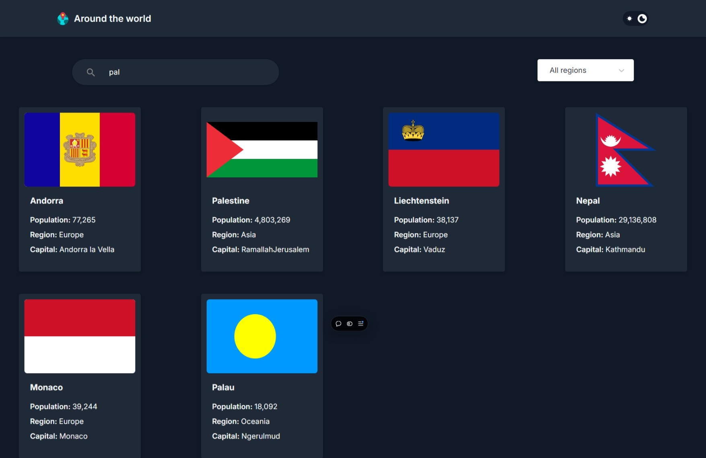

# Around the World 🌍

A React.js project showcasing a user-friendly interface to explore countries around the world. The app fetches data using the REST Countries API and displays it in an interactive and visually appealing manner.

## Features

- **Country Cards:** Displays country data in cards, including population, region, and capital.
- **Detailed View:** Click on any country card to see more detailed information.
- **Search Functionality:** Search for a specific country using the search bar.
- **Region Filter:** Filter results by continent (region).
- **Light/Dark Mode:** Switch between light and dark themes for a better user experience.

## Preview



## Technologies Used

- **React.js:** For building the user interface.
- **REST Countries API:** To fetch country data.
- **Tailwind Css:** For styling the app, including light/dark mode.

## How to Run the Project Locally

1. Clone the repository:

   ```bash
   git clone https://github.com/your-username/around-the-world.git
   ```

2. Navigate to the project directory:

   ```bash
   cd around-the-world
   ```

3. Install dependencies:

   ```bash
   npm install
   ```

4. Start the development server:

   ```bash
   npm start
   ```

5. Open your browser and go to:
   ```
   http://localhost:3000
   ```

## REST Countries API

This project uses the [REST Countries API](https://restcountries.com) to fetch real-time data about countries. Check the API documentation for more details.

## Deployment

The app is deployed on **Vercel**. You can access the live version [here](https://around-the-world-reactjs.vercel.app/).

## Contributing

Contributions are welcome! To contribute:

1. Fork the repository.
2. Create a new branch (`git checkout -b feature-name`).
3. Commit your changes (`git commit -m 'Add feature'`).
4. Push to the branch (`git push origin feature-name`).
5. Open a pull request.

---

Made by [Yusif Ayman](https://yusuf-ayman.vercel.app/)
